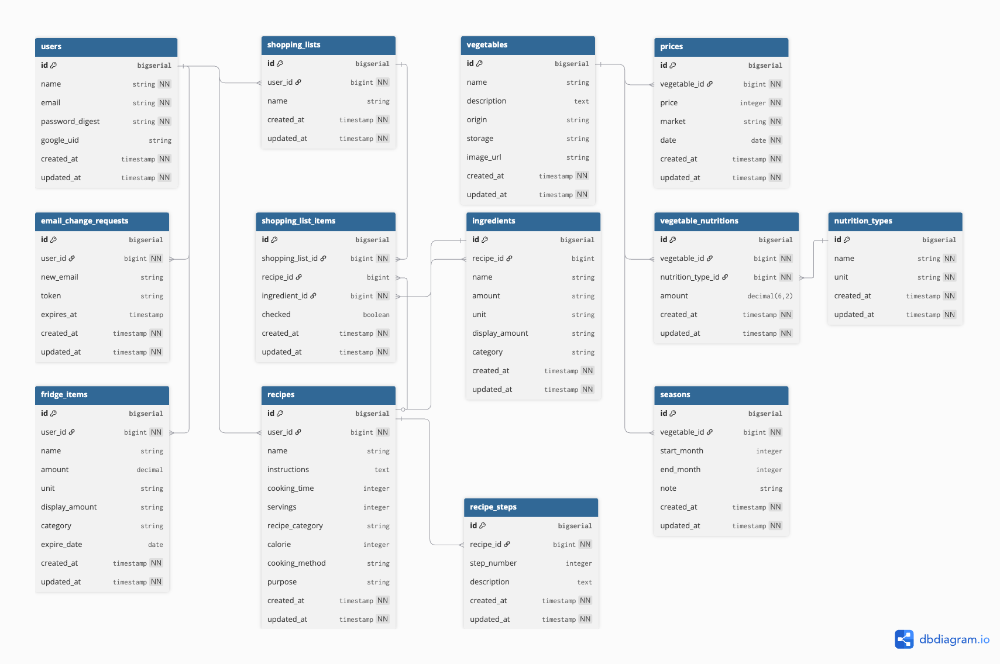
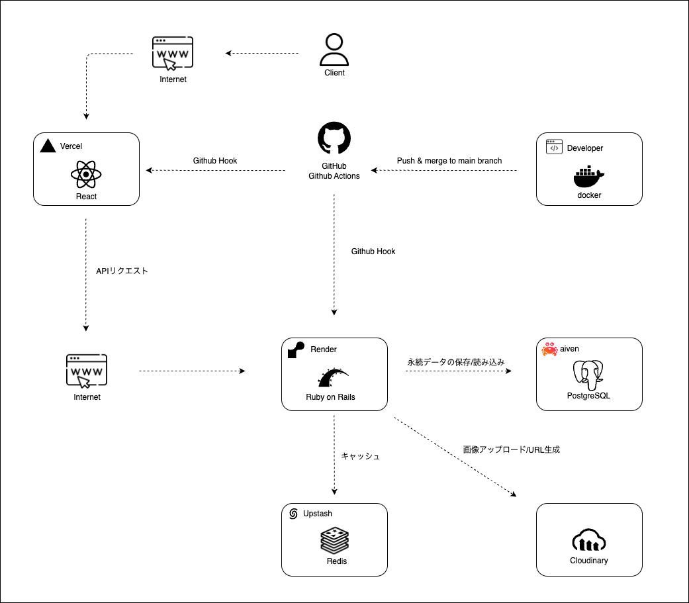

# **VegeGuide**
> 忙しい社会人のための野菜選び・レシピ提案・食材管理サービス  
### 🔗 [実際のサービスはこちら](https://vegeguide.com/)

## 各リポジトリ一覧

| リポジトリ名 | 内容説明               | リンク                                                |
|--------------|------------------------|-----------------------------------------------------|
| Backend      | APIサーバー（Rails）   | [github.com/pekoemood/vegeguidebackend](https://github.com/pekoemood/vegeguidebackend)     |
| Frontend     | フロントエンド（React） | [github.com/pekoemood/vegeguidefrontend](https://github.com/pekoemood/vegeguidefrontend)   |

## 📌 サービス概要

**VegeGuide**は、忙しい社会人が「何を買えばいいのか」「どう使えばいいのか」と迷う日常をなくすためのWebサービスです。  
野菜を中心とした食生活を、**選ぶ・作る・管理する**までトータルでサポートします。

ユーザーは、**旬で安く美味しい野菜を選び、AIが提案するレシピで効率的に調理し、食材を無駄にしない**という結果を得られます。  
料理初心者でも、**今日何を作るか迷わず、ムダなく健康的に食生活を楽しめる**ようになります。

## 🛠️ 開発背景

私自身が30歳を迎え、健康的な食生活を始めようとしたとき、  
「どの野菜を選べばいいのか」「どう調理すればいいのか」がわからず、迷う日々が続きました。  
気づけばいつも同じような野菜ばかり選び、同じ料理を繰り返してしまっていたのです。  
忙しい社会人生活の中で、食材選びや調理のハードルの高さを実感したことが、このサービスを作るきっかけです。

- スーパーで野菜を見ても「どの野菜が旬なのか」「どう調理すればいいのか」がわからない  
- 野菜を買っても使い切れず、腐らせてしまう  
- 健康的な食事を心がけたいが、レシピを考えるのが面倒  
- 食材の栄養価や保存方法など、基本的な知識がなく迷いを感じる  

こうした課題を解決し、「迷わず・ムダなく・健康的に」食生活を楽しめるよう、  
野菜選びから調理までをサポートするWebサービスを開発しました。

## 🧭 サービス利用イメージ

1. **仕事帰りにアプリを開く**  
　└ 今日の旬・価格の安い野菜を確認

2. **AIによるレシピ提案を受ける**  
　└ AIが旬の野菜をもとにレシピを自動生成  

3. **レシピをもとに買い物リストを自動作成**  
　└ 必要な食材を必要なだけ無駄なく購入  

4. **買い物後、レシピ情報をもとに調理開始**  
　└ 手順付きレシピでスムーズに調理  

5. **余った材料を冷蔵庫機能に登録**  
　└ 食材の在庫と賞味期限をまとめて管理 

6. **余った食材から新しいレシピを再提案**  
　└ 無駄なく、食材を最後まで使い切る

## 🎬 デモ・スクリーンショット

### 🏷️ 1. トップページ（今日のおすすめ野菜をチェック）
仕事帰りにアプリを開くと、旬で価格の安い野菜が一目でわかります。  

---

### 🤖 2. AIレシピ提案（Gemini APIによる自動生成）
選んだ野菜から、AIがレシピを自動提案します。  
必要な材料も同時に確認でき、買い物リストを自動作成。  

---

### 🧊 3. 冷蔵庫管理（余った食材を登録・再提案）
購入後の余り食材は冷蔵庫に登録。  
期限や在庫を管理し、次のレシピ提案に活かします。  

## 🧪 技術スタック

### 🔙 バックエンド

| 技術             | バージョン  | 用途                         |
|------------------|-------------|------------------------------|
| Ruby on Rails    | 7.2.2       | APIサーバー                  |
| PostgreSQL       | -           | メインデータベース           |
| GoodJob          | -           | 非同期処理エンジン           |
| RSpec            | -           | テストフレームワーク         |
| bcrypt           | 3.1.7       | パスワードハッシュ化         |
| JWT              | -           | 認証トークン                 |
| HTTParty         | -           | HTTP通信ライブラリ           |

### 🖥️ フロントエンド

| 技術              | バージョン | 用途                             |
|-------------------|------------|----------------------------------|
| React             | 19.0.0     | UIフレームワーク（最新機能活用）|
| Vite              | 6.2.0      | 高速ビルドツール                 |
| Tailwind CSS      | 4.1.3      | ユーティリティファーストCSS      |
| DaisyUI           | 5.0.12     | UIコンポーネントライブラリ       |
| React Hook Form   | 7.55.0     | フォーム管理                     |
| Zod               | 3.24.3     | スキーマバリデーション           |
| Recharts          | 2.15.3     | データ可視化ライブラリ           |
| React Router      | 7.5.0      | ルーティング                     |
| React Hot Toast   | 2.5.2      | 通知UI                          |
| Lucide React      | 0.507.0    | アイコンライブラリ               |
| Axios             | 1.8.4      | HTTP通信ライブラリ               |
| date-fns          | 4.1.0      | 日付処理ライブラリ               |

### 🔐 認証・セキュリティ

| 技術             | バージョン | 用途                         |
|------------------|------------|------------------------------|
| JWT              | -          | 認証トークン                 |
| bcrypt           | 3.1.7      | パスワードハッシュ化         |
| Google OAuth     | 0.12.2     | Googleログイン               |
| Google Auth      | 1.14       | Google認証ライブラリ         |
| CORS             | -          | クロスオリジンリクエスト制御 |

### 🌐 外部API・サービス

| サービス名           | 用途                          |
|----------------------|-------------------------------|
| Google Gemini API    | AI文章生成・レシピ生成        |
| Cloudinary           | 画像管理・最適化サービス      |
| 青果物市況情報Web API | 野菜価格データ取得           |
| Google API Client    | 0.53.0                       |

### ☁️ インフラ・デプロイ

| 技術/サービス  | 用途                        |
|----------------|-----------------------------|
| Docker         | コンテナ化（開発環境）       |
| Docker Compose | 開発環境オーケストレーション |
| Render         | バックエンドホスティング     |
| Vercel         | フロントエンドホスティング   |

### 🧰 開発ツール・テスト

| ツール / ライブラリ                  | バージョン | 用途                                   |
|-------------------------------------|------------|----------------------------------------|
| **RuboCop**                         | -          | Ruby静的解析・コード整形               |
| **Biome (`@biomejs/biome`)**        | 1.9.4      | JavaScript/TypeScript静的解析・整形    |
| **SimpleCov**                       | -          | Railsテストカバレッジ測定              |
| **RSpec**                           | -          | Rails単体テスト                        |
| **Factory Bot**                     | -          | テストデータ生成                       |
| **Shoulda Matchers**                | -          | RSpec追加マッチャー                   |
| **Brakeman**                        | -          | Railsセキュリティ脆弱性検査            |
| **Letter Opener**                   | -          | メール開発確認ツール                   |
| **Vitest (`vitest`)**               | 3.2.4      | フロントエンド単体テストランナー        |
| **Testing Library (React)**         | 16.3.0     | Reactコンポーネントのテスト支援         |
| **Jest-DOM (`@testing-library/jest-dom`)** | 6.8.0 | DOMアサーション拡張                    |
| **User Event (`@testing-library/user-event`)** | 14.6.1 | ユーザー操作のシミュレーション          |
| **jsdom**                           | 26.1.0     | Node.js 環境でブラウザDOMをエミュレート |
| **TypeScript**                      | 5.8.3      | 型チェック（`npm run type-check`）      |

## 技術的こだわり・実装工夫

## 🚧 今後の展開

### 🐣 短期目標（3ヶ月）

#### 📱 UI/UX改善・最適化
- **レスポンシブデザインの完全対応** - モバイルファースト設計への移行
- **パフォーマンス最適化** - 画像最適化、遅延読み込み、キャッシュ戦略

#### 🔔 リアルタイム機能強化
- **価格通知機能** - WebSocketまたはServer-Sent Events実装
- **在庫期限アラート** - 冷蔵庫アイテムの賞味期限通知
- **旬の野菜お知らせ** - 季節の変わり目での自動通知

#### 💬 ユーザーエンゲージメント
- **フィードバック機能** - レシピ評価、改善提案収集
- **使用状況分析** - Google Analytics 4, ヒートマップ分析
- **オンボーディング改善** - 新規ユーザー向けチュートリアル

### 🚀 中期目標（6ヶ月）

#### 📲 プラットフォーム拡張
- **PWA対応** - ServiceWorker、オフライン機能、プッシュ通知

#### 🗺️ データ機能強化
- **地域別価格比較** - 地域APIの追加統合

#### 🥗 コンテンツ拡充
- **季節レシピ特集** - 旬の食材を活かした特別コンテンツ
- **料理動画連携** - YouTube API統合、視覚的レシピガイド
- **野菜の栄養素のグラフ化** - Recharts等を活用し栄養価の見える化

### 🏢 長期目標（1年）

#### 🌏 技術・事業拡張
- **AI機能強化** - 音声レシピ読み上げ
- **収益化戦略** - プレミアム機能、アフィリエイト、データ販売

## 🗂️ ER図（データモデル設計）

> ※ 本ER図は主要なドメインモデルを示しています。  
>   ActiveStorageやGoodJobのテーブルは含まれていません。

## 🗄️ インフラ図

